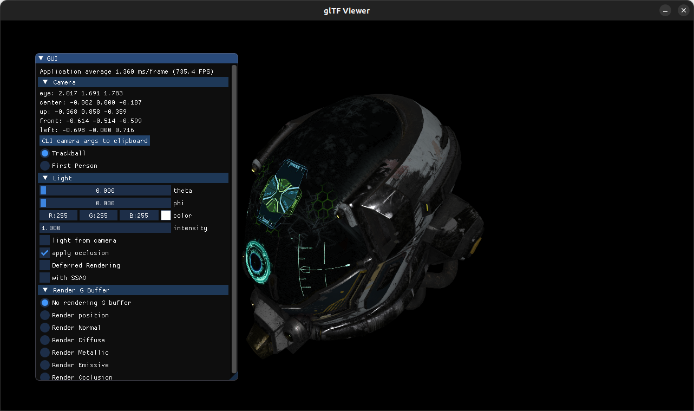
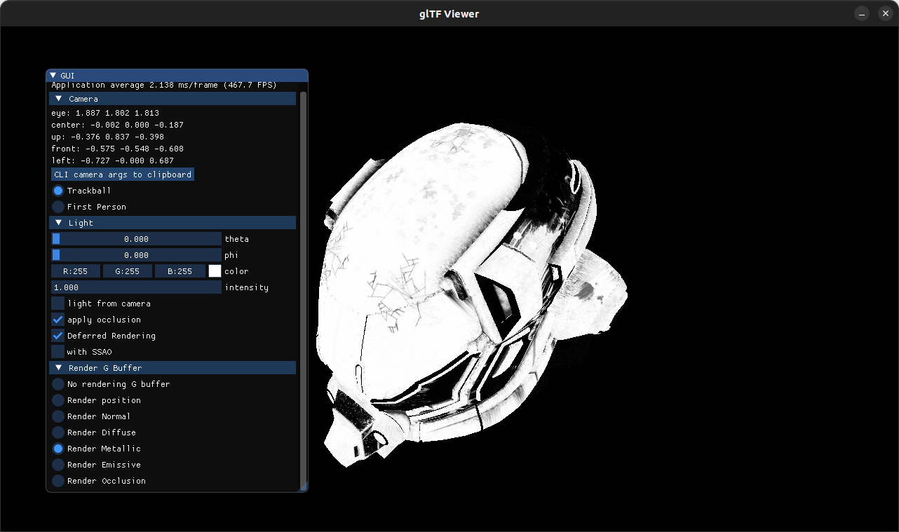
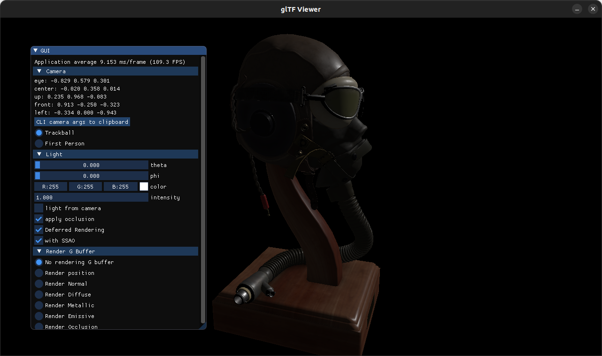

# glTF Viewer Tutorial Code


## How to Install

First of all for running the Project you will need a recent Debian based distributions. You will also need a gcc recent compiler which can compile c++17 code or above. 

<br> 
Once you have this requirements fulfilled you will need to install few libraries.

<br>

### Loading dependencies and model visualization
This can be done with the following command:
<br>

```code
source bash-init.sh 
view_helmet
```

### Graphics Details of Implementation
I choose the subject of Deferred Rendering with SSAO Post processing. 
The main difficulty of the project were encounter with the deferred rendering implementation. I had issues whith getting the correct data from the gbuffer for the lightning calculation. Once deferred rendering was working correctly the ssao implementation was easy. For the implementation I fully followed the tutorials of learnopengl by Joey de Vries.

### How to use the GUI window options

By default the application render the scene in forward pass mode with occlusion. If you want to apply ssao post process you have to check the deferred rendering option too. It is the same if you want to display gbuffer content. So in my application deferred rendering option is mandatory if you want ssao or display any content of the gbuffer. You can also change light properties such as direction,intensity and color.

### Some screenshots

<br>
Gbuffer metallic of helmet


<br>
Fly Helmet with ssao




